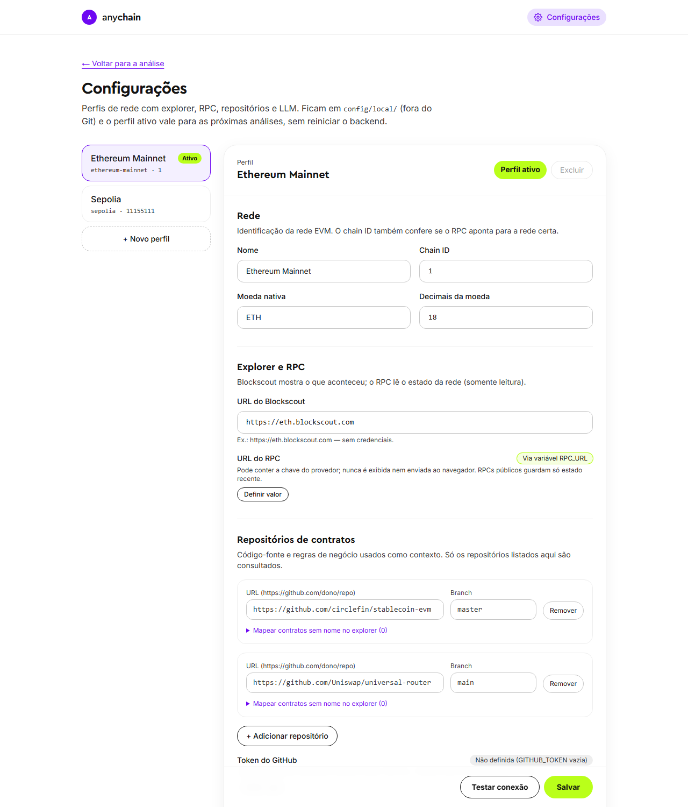

# Anychain Transaction Assistant

Assistente local que explica e diagnostica transações EVM a partir de evidências verificáveis. Você informa o hash de uma transação e recebe o que aconteceu (função, argumentos, transferências, eventos), por que falhou (quando falhou) e uma explicação em linguagem natural que cita cada evidência usada.

A ferramenta só lê dados: não assina nem envia transações. Explorer, RPC, repositórios e modelo vêm de configuração, então trocar de rede não exige mudar código.

```text
Blockscout   -> o que aconteceu (transação, recibo, logs, ABI, código verificado)
RPC          -> estado da blockchain (eth_call, saldos, repetição no bloco anterior)
Repositórios -> por que o contrato se comporta assim (Solidity no GitHub, com commit e linhas)
LLM          -> raciocina sobre as evidências e explica, citando-as
```

Coleta, decodificação e diagnóstico são determinísticos e acontecem antes do LLM; o modelo só interpreta e precisa citar evidências existentes. Detalhes técnicos em [`docs/funcionamento.md`](docs/funcionamento.md).

## Como rodar

### Com Docker (recomendado)

Requer Docker com Compose v2.24+.

```bash
docker compose up --build
```

### Sem Docker

Requer Python 3.12+, Node.js 20.9+ e npm.

```bash
# backend
python3 -m venv .venv
.venv/bin/python -m pip install -r backend/requirements-dev.lock
.venv/bin/python -m pip install -e './backend[dev]'
.venv/bin/python -m uvicorn app.main:app --app-dir backend --host 127.0.0.1 --port 8000

# frontend, em outro terminal
cd frontend && npm ci && npm run dev
```

No Windows (PowerShell), use `.\.venv\Scripts\python.exe` no lugar de `.venv/bin/python` e `npm.cmd` no lugar de `npm`.

Nos dois casos, abra <http://127.0.0.1:3000>. Sem nenhuma configuração extra, a análise já funciona com o Blockscout público da Ethereum Mainnet, mas sem RPC e sem explicação por IA.

## Variáveis de ambiente (opcional)

Para habilitar RPC e a explicação por IA, crie o `.env` e preencha as variáveis desejadas antes de subir a aplicação:

```bash
cp .env.example .env
```

Configuração mínima recomendada:

```bash
RPC_URL=https://ethereum-rpc.publicnode.com
LLM_PROVIDER=openai
LLM_MODEL=gpt-5-mini
OPENAI_API_KEY=sk-...
```

| Variável | Uso |
| --- | --- |
| `APP_CONFIG` | YAML da rede (padrão: `config/ethereum-mainnet.example.yaml`) |
| `RPC_URL` | Endpoint RPC. Sem ele, não há leituras de estado |
| `GITHUB_TOKEN` | Sem ele, o GitHub limita a 60 requisições por hora |
| `LLM_PROVIDER`, `LLM_MODEL` | `openai` ou `gemini` e o modelo. Vazios desativam a explicação |
| `OPENAI_API_KEY`, `GEMINI_API_KEY` | Chave do provedor escolhido |

Segredos nunca aparecem em respostas nem em logs.

## Configuração

Cada rede é um **perfil** com explorer, RPC, repositórios e LLM. Ele pode ser configurado de duas formas, e as duas usam as mesmas regras de validação.

### Pela interface

A página **Configurações** (botão no canto superior direito) permite criar, editar, duplicar, ativar e excluir perfis, além de **testar a conexão** com explorer, RPC, repositórios e LLM. As mudanças valem para as próximas análises, sem reiniciar o backend.



Os perfis ficam em `config/local/` (ignorado pelo Git). Na primeira execução, essa pasta é preenchida a partir dos arquivos em `config/`; apagá-la volta aos exemplos (no Docker, os perfis ficam num volume, e `docker compose down -v` faz o mesmo). Segredos (chave do RPC, token do GitHub, chave do LLM) podem ser definidos pela interface, mas nunca são exibidos.

### Por arquivo

Crie um YAML com a estrutura abaixo e aponte `APP_CONFIG` para ele. Exemplos completos: [`config/ethereum-mainnet.example.yaml`](config/ethereum-mainnet.example.yaml) e [`config/sepolia.example.yaml`](config/sepolia.example.yaml).

```yaml
network:
  id: ethereum-mainnet
  name: Ethereum Mainnet
  chain_id: 1
  native_currency: ETH
  native_decimals: 18
explorer:
  type: blockscout
  base_url: https://eth.blockscout.com      # raiz pública, sem /api/v2
rpc:
  url: ${RPC_URL:-}
repositories:
  - url: https://github.com/circlefin/stablecoin-evm
    branch: master
  - url: https://github.com/Uniswap/universal-router
    branch: main
    # contracts:                             # opcional: nomes para contratos não verificados
    #   - address: "0x..."
    #     name: MeuContrato
github:
  token: ${GITHUB_TOKEN:-}
abi:
  strategies: [explorer, repository]
llm:
  provider: ${LLM_PROVIDER:-}               # openai | gemini
  model: ${LLM_MODEL:-}
  thinking_level: ${LLM_THINKING_LEVEL:-low}
analysis:
  max_agent_steps: 10
  max_output_tokens: 8192
  agent_timeout_seconds: 90
  tool_timeout_seconds: 15
  max_repository_excerpt_chars: 12000
  include_security_notes: true
```

`${VAR}` exige uma variável não vazia; `${VAR:-valor}` define um padrão. Campos desconhecidos ou inválidos impedem a inicialização. Os demais limites de `analysis` têm valores padrão (veja o exemplo completo).

Como os perfis locais passam a ser a fonte da configuração depois da primeira execução, um novo `APP_CONFIG` só vale com `config/local/` vazio (ou apagado). Para trocar de rede no dia a dia, use a interface. Exemplo de outra rede: Base (`chain_id: 8453`, explorer `https://base.blockscout.com`, RPC `https://mainnet.base.org`).

## Exemplos

Três análises reais na Ethereum Mainnet com `gpt-5-mini`, cada uma em um foco. As respostas completas, com todas as evidências citadas e uma nota de revisão, estão em [`examples/`](examples/README.md).

| # | Caso | Foco | Hash |
| --- | --- | --- | --- |
| 1 | Transferência ERC-20 (USDT) | `support` | `0x0efab637e8e1a0503bf7e0e9e28a981bd83827cd2cbf73964938097e4f7e3ec9` |
| 2 | Falha “Price slippage check” (Uniswap V3) | `developer` | `0xa0107a2a9736dfbde0c1dbfd0d53fd2e8c122f3b9177675e058735e427b1ae0d` |
| 3 | USDC via proxy com repositório | `auditor` | `0x10cf88efd1ecf75d7599ab932d7dde19be9bb723f82bd5b2dae55fb2373255b1` |

Para testar:

1 - Pela interface, cole o hash e escolha o foco.
 
2 - Pela API:

```bash
curl -X POST http://127.0.0.1:3000/api/analyze \
  -H "Content-Type: application/json" \
  -d '{"tx_hash": "0x...", "mode": "support"}'   # support | developer | auditor
```